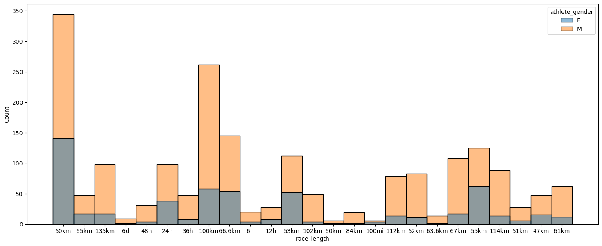
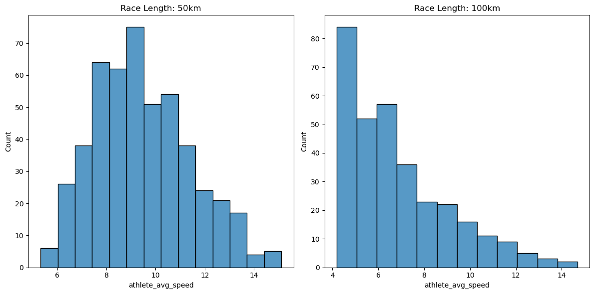
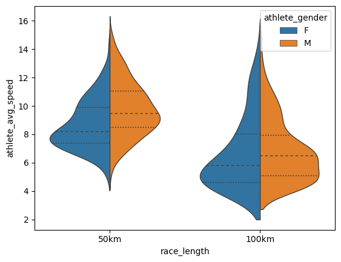
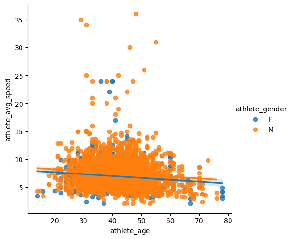

# Link to the dataset
https://www.kaggle.com/datasets/aiaiaidavid/the-big-dataset-of-ultra-marathon-running/data

# Import libraries


```python
import pandas as pd
import seaborn as sns
import matplotlib.pyplot as plt
```

# Create dataframe


```python
df = pd.read_csv('ultra_marathon_data.csv')
```

# Discover the data, that has been imported 


```python
df.head()
```


<div>
<style scoped>
    .dataframe tbody tr th:only-of-type {
        vertical-align: middle;
    }

    .dataframe tbody tr th {
        vertical-align: top;
    }

    .dataframe thead th {
        text-align: right;
    }
</style>
<table border="1" class="dataframe">
  <thead>
    <tr style="text-align: right;">
      <th></th>
      <th>Year of event</th>
      <th>Event dates</th>
      <th>Event name</th>
      <th>Event distance/length</th>
      <th>Event number of finishers</th>
      <th>Athlete performance</th>
      <th>Athlete club</th>
      <th>Athlete country</th>
      <th>Athlete year of birth</th>
      <th>Athlete gender</th>
      <th>Athlete age category</th>
      <th>Athlete average speed</th>
      <th>Athlete ID</th>
    </tr>
  </thead>
  <tbody>
    <tr>
      <th>0</th>
      <td>2018</td>
      <td>06.01.2018</td>
      <td>Selva Costera (CHI)</td>
      <td>50km</td>
      <td>22</td>
      <td>4:51:39 h</td>
      <td>Tnfrc</td>
      <td>CHI</td>
      <td>1978.0</td>
      <td>M</td>
      <td>M35</td>
      <td>10.286</td>
      <td>0</td>
    </tr>
    <tr>
      <th>1</th>
      <td>2018</td>
      <td>06.01.2018</td>
      <td>Selva Costera (CHI)</td>
      <td>50km</td>
      <td>22</td>
      <td>5:15:45 h</td>
      <td>Roberto Echeverría</td>
      <td>CHI</td>
      <td>1981.0</td>
      <td>M</td>
      <td>M35</td>
      <td>9.501</td>
      <td>1</td>
    </tr>
    <tr>
      <th>2</th>
      <td>2018</td>
      <td>06.01.2018</td>
      <td>Selva Costera (CHI)</td>
      <td>50km</td>
      <td>22</td>
      <td>5:16:44 h</td>
      <td>Puro Trail Osorno</td>
      <td>CHI</td>
      <td>1987.0</td>
      <td>M</td>
      <td>M23</td>
      <td>9.472</td>
      <td>2</td>
    </tr>
    <tr>
      <th>3</th>
      <td>2018</td>
      <td>06.01.2018</td>
      <td>Selva Costera (CHI)</td>
      <td>50km</td>
      <td>22</td>
      <td>5:34:13 h</td>
      <td>Columbia</td>
      <td>ARG</td>
      <td>1976.0</td>
      <td>M</td>
      <td>M40</td>
      <td>8.976</td>
      <td>3</td>
    </tr>
    <tr>
      <th>4</th>
      <td>2018</td>
      <td>06.01.2018</td>
      <td>Selva Costera (CHI)</td>
      <td>50km</td>
      <td>22</td>
      <td>5:54:14 h</td>
      <td>Baguales Trail</td>
      <td>CHI</td>
      <td>1992.0</td>
      <td>M</td>
      <td>M23</td>
      <td>8.469</td>
      <td>4</td>
    </tr>
  </tbody>
</table>
</div>


```python
df.shape
```


    (7461195, 13)


```python
df.dtypes
```


    Year of event                  int64
    Event dates                   object
    Event name                    object
    Event distance/length         object
    Event number of finishers      int64
    Athlete performance           object
    Athlete club                  object
    Athlete country               object
    Athlete year of birth        float64
    Athlete gender                object
    Athlete age category          object
    Athlete average speed         object
    Athlete ID                     int64
    dtype: object


# Clean up data
Only want Races in the Czech Republic or Slovakia in 2022


```python
df[(df['Event name'].str.contains('CZE|SVK')) & (df['Year of event'] == 2022)].head()
```


<div>
<style scoped>
    .dataframe tbody tr th:only-of-type {
        vertical-align: middle;
    }

    .dataframe tbody tr th {
        vertical-align: top;
    }

    .dataframe thead th {
        text-align: right;
    }
</style>
<table border="1" class="dataframe">
  <thead>
    <tr style="text-align: right;">
      <th></th>
      <th>Year of event</th>
      <th>Event dates</th>
      <th>Event name</th>
      <th>Event distance/length</th>
      <th>Event number of finishers</th>
      <th>Athlete performance</th>
      <th>Athlete club</th>
      <th>Athlete country</th>
      <th>Athlete year of birth</th>
      <th>Athlete gender</th>
      <th>Athlete age category</th>
      <th>Athlete average speed</th>
      <th>Athlete ID</th>
    </tr>
  </thead>
  <tbody>
    <tr>
      <th>3144592</th>
      <td>2022</td>
      <td>05.03.2022</td>
      <td>Běhu na 50 Km Pilsen (CZE)</td>
      <td>50km</td>
      <td>5</td>
      <td>4:09:11 h</td>
      <td>Srtg Most</td>
      <td>CZE</td>
      <td>1983.0</td>
      <td>F</td>
      <td>W35</td>
      <td>12.039</td>
      <td>948743</td>
    </tr>
    <tr>
      <th>3144593</th>
      <td>2022</td>
      <td>05.03.2022</td>
      <td>Běhu na 50 Km Pilsen (CZE)</td>
      <td>50km</td>
      <td>5</td>
      <td>4:17:11 h</td>
      <td>MK Kladno</td>
      <td>CZE</td>
      <td>1984.0</td>
      <td>M</td>
      <td>M35</td>
      <td>11.665</td>
      <td>119714</td>
    </tr>
    <tr>
      <th>3144594</th>
      <td>2022</td>
      <td>05.03.2022</td>
      <td>Běhu na 50 Km Pilsen (CZE)</td>
      <td>50km</td>
      <td>5</td>
      <td>4:19:27 h</td>
      <td>Rumning Klap</td>
      <td>CZE</td>
      <td>1967.0</td>
      <td>M</td>
      <td>M50</td>
      <td>11.563</td>
      <td>167471</td>
    </tr>
    <tr>
      <th>3144595</th>
      <td>2022</td>
      <td>05.03.2022</td>
      <td>Běhu na 50 Km Pilsen (CZE)</td>
      <td>50km</td>
      <td>5</td>
      <td>4:29:10 h</td>
      <td>*Chedenice</td>
      <td>CZE</td>
      <td>1978.0</td>
      <td>F</td>
      <td>W40</td>
      <td>11.146</td>
      <td>119731</td>
    </tr>
    <tr>
      <th>3144596</th>
      <td>2022</td>
      <td>05.03.2022</td>
      <td>Běhu na 50 Km Pilsen (CZE)</td>
      <td>50km</td>
      <td>5</td>
      <td>5:51:08 h</td>
      <td>Irico Olomouc</td>
      <td>CZE</td>
      <td>1952.0</td>
      <td>M</td>
      <td>M65</td>
      <td>8.544</td>
      <td>416487</td>
    </tr>
  </tbody>
</table>
</div>


# Assign the filtered data into a new dataframe


```python
df2 = df[(df['Event name'].str.contains('CZE|SVK')) & (df['Year of event'] == 2022)]
```


```python
df2.shape
```


    (2537, 13)


# Clean up athlete age
Subtract the athlete's year of birth from 2022 and create a new column 


```python
df2['athlete_age'] = 2022 - df2['Athlete year of birth']
```
    

# Remove 'h' from Athlete performance column


```python
df2['Athlete performance'] = df2['Athlete performance'].str.split(' ').str.get(0)
```


# Drop columns: Athlete club, Athlete age category, Athlete year of birth


```python
df2 = df2.drop(['Athlete club', 'Athlete year of birth', 'Athlete age category'], axis=1)
```

# Clean up null values


```python
df2.isna().sum()
```


    Year of event                 0
    Event dates                   0
    Event name                    0
    Event distance/length         0
    Event number of finishers     0
    Athlete performance           0
    Athlete country               0
    Athlete gender                0
    Athlete average speed         0
    Athlete ID                    0
    athlete_age                  13
    dtype: int64


```python
df2[df2['athlete_age'].isna()==True].head()
```


<div>
<style scoped>
    .dataframe tbody tr th:only-of-type {
        vertical-align: middle;
    }

    .dataframe tbody tr th {
        vertical-align: top;
    }

    .dataframe thead th {
        text-align: right;
    }
</style>
<table border="1" class="dataframe">
  <thead>
    <tr style="text-align: right;">
      <th></th>
      <th>Year of event</th>
      <th>Event dates</th>
      <th>Event name</th>
      <th>Event distance/length</th>
      <th>Event number of finishers</th>
      <th>Athlete performance</th>
      <th>Athlete country</th>
      <th>Athlete gender</th>
      <th>Athlete average speed</th>
      <th>Athlete ID</th>
      <th>athlete_age</th>
    </tr>
  </thead>
  <tbody>
    <tr>
      <th>3190776</th>
      <td>2022</td>
      <td>22.-23.04.2022</td>
      <td>Big Bear’s Backyard Ultra (SVK)</td>
      <td>36h</td>
      <td>68</td>
      <td>167.650</td>
      <td>SVK</td>
      <td>M</td>
      <td>25</td>
      <td>945596</td>
      <td>NaN</td>
    </tr>
    <tr>
      <th>3190799</th>
      <td>2022</td>
      <td>22.-23.04.2022</td>
      <td>Big Bear’s Backyard Ultra (SVK)</td>
      <td>36h</td>
      <td>68</td>
      <td>100.590</td>
      <td>SVK</td>
      <td>M</td>
      <td>15</td>
      <td>956948</td>
      <td>NaN</td>
    </tr>
    <tr>
      <th>3190806</th>
      <td>2022</td>
      <td>22.-23.04.2022</td>
      <td>Big Bear’s Backyard Ultra (SVK)</td>
      <td>36h</td>
      <td>68</td>
      <td>87.178</td>
      <td>SVK</td>
      <td>M</td>
      <td>13</td>
      <td>956950</td>
      <td>NaN</td>
    </tr>
    <tr>
      <th>3190807</th>
      <td>2022</td>
      <td>22.-23.04.2022</td>
      <td>Big Bear’s Backyard Ultra (SVK)</td>
      <td>36h</td>
      <td>68</td>
      <td>80.472</td>
      <td>SVK</td>
      <td>F</td>
      <td>12</td>
      <td>956951</td>
      <td>NaN</td>
    </tr>
    <tr>
      <th>3190818</th>
      <td>2022</td>
      <td>22.-23.04.2022</td>
      <td>Big Bear’s Backyard Ultra (SVK)</td>
      <td>36h</td>
      <td>68</td>
      <td>80.472</td>
      <td>SVK</td>
      <td>M</td>
      <td>12</td>
      <td>956953</td>
      <td>NaN</td>
    </tr>
  </tbody>
</table>
</div>


```python
df2 = df2.dropna()
```

# Check for duplicates


```python
df2[df2.duplicated() == True]
```


<div>
<style scoped>
    .dataframe tbody tr th:only-of-type {
        vertical-align: middle;
    }

    .dataframe tbody tr th {
        vertical-align: top;
    }

    .dataframe thead th {
        text-align: right;
    }
</style>
<table border="1" class="dataframe">
  <thead>
    <tr style="text-align: right;">
      <th></th>
      <th>Year of event</th>
      <th>Event dates</th>
      <th>Event name</th>
      <th>Event distance/length</th>
      <th>Event number of finishers</th>
      <th>Athlete performance</th>
      <th>Athlete country</th>
      <th>Athlete gender</th>
      <th>Athlete average speed</th>
      <th>Athlete ID</th>
      <th>athlete_age</th>
    </tr>
  </thead>
  <tbody>
  </tbody>
</table>
</div>


# Reset index


```python
df2.reset_index(drop=True)
```


<div>
<style scoped>
    .dataframe tbody tr th:only-of-type {
        vertical-align: middle;
    }

    .dataframe tbody tr th {
        vertical-align: top;
    }

    .dataframe thead th {
        text-align: right;
    }
</style>
<table border="1" class="dataframe">
  <thead>
    <tr style="text-align: right;">
      <th></th>
      <th>Year of event</th>
      <th>Event dates</th>
      <th>Event name</th>
      <th>Event distance/length</th>
      <th>Event number of finishers</th>
      <th>Athlete performance</th>
      <th>Athlete country</th>
      <th>Athlete gender</th>
      <th>Athlete average speed</th>
      <th>Athlete ID</th>
      <th>athlete_age</th>
    </tr>
  </thead>
  <tbody>
    <tr>
      <th>0</th>
      <td>2022</td>
      <td>05.03.2022</td>
      <td>Běhu na 50 Km Pilsen (CZE)</td>
      <td>50km</td>
      <td>5</td>
      <td>4:09:11</td>
      <td>CZE</td>
      <td>F</td>
      <td>12.039</td>
      <td>948743</td>
      <td>39.0</td>
    </tr>
    <tr>
      <th>1</th>
      <td>2022</td>
      <td>05.03.2022</td>
      <td>Běhu na 50 Km Pilsen (CZE)</td>
      <td>50km</td>
      <td>5</td>
      <td>4:17:11</td>
      <td>CZE</td>
      <td>M</td>
      <td>11.665</td>
      <td>119714</td>
      <td>38.0</td>
    </tr>
    <tr>
      <th>2</th>
      <td>2022</td>
      <td>05.03.2022</td>
      <td>Běhu na 50 Km Pilsen (CZE)</td>
      <td>50km</td>
      <td>5</td>
      <td>4:19:27</td>
      <td>CZE</td>
      <td>M</td>
      <td>11.563</td>
      <td>167471</td>
      <td>55.0</td>
    </tr>
    <tr>
      <th>3</th>
      <td>2022</td>
      <td>05.03.2022</td>
      <td>Běhu na 50 Km Pilsen (CZE)</td>
      <td>50km</td>
      <td>5</td>
      <td>4:29:10</td>
      <td>CZE</td>
      <td>F</td>
      <td>11.146</td>
      <td>119731</td>
      <td>44.0</td>
    </tr>
    <tr>
      <th>4</th>
      <td>2022</td>
      <td>05.03.2022</td>
      <td>Běhu na 50 Km Pilsen (CZE)</td>
      <td>50km</td>
      <td>5</td>
      <td>5:51:08</td>
      <td>CZE</td>
      <td>M</td>
      <td>8.544</td>
      <td>416487</td>
      <td>70.0</td>
    </tr>
    <tr>
      <th>...</th>
      <td>...</td>
      <td>...</td>
      <td>...</td>
      <td>...</td>
      <td>...</td>
      <td>...</td>
      <td>...</td>
      <td>...</td>
      <td>...</td>
      <td>...</td>
      <td>...</td>
    </tr>
    <tr>
      <th>2519</th>
      <td>2022</td>
      <td>22.10.2022</td>
      <td>Slapy Trail Maniacs (CZE)</td>
      <td>61km</td>
      <td>74</td>
      <td>10:31:22</td>
      <td>CZE</td>
      <td>M</td>
      <td>5.797</td>
      <td>310562</td>
      <td>49.0</td>
    </tr>
    <tr>
      <th>2520</th>
      <td>2022</td>
      <td>22.10.2022</td>
      <td>Slapy Trail Maniacs (CZE)</td>
      <td>61km</td>
      <td>74</td>
      <td>11:00:06</td>
      <td>CZE</td>
      <td>M</td>
      <td>5.545</td>
      <td>777810</td>
      <td>38.0</td>
    </tr>
    <tr>
      <th>2521</th>
      <td>2022</td>
      <td>22.10.2022</td>
      <td>Slapy Trail Maniacs (CZE)</td>
      <td>61km</td>
      <td>74</td>
      <td>11:00:06</td>
      <td>CZE</td>
      <td>M</td>
      <td>5.545</td>
      <td>777811</td>
      <td>35.0</td>
    </tr>
    <tr>
      <th>2522</th>
      <td>2022</td>
      <td>22.10.2022</td>
      <td>Slapy Trail Maniacs (CZE)</td>
      <td>61km</td>
      <td>74</td>
      <td>11:29:06</td>
      <td>CZE</td>
      <td>M</td>
      <td>5.311</td>
      <td>1043284</td>
      <td>34.0</td>
    </tr>
    <tr>
      <th>2523</th>
      <td>2022</td>
      <td>22.10.2022</td>
      <td>Slapy Trail Maniacs (CZE)</td>
      <td>61km</td>
      <td>74</td>
      <td>12:01:54</td>
      <td>CZE</td>
      <td>M</td>
      <td>5.07</td>
      <td>724855</td>
      <td>46.0</td>
    </tr>
  </tbody>
</table>
<p>2524 rows × 11 columns</p>
</div>


# Fix data types


```python
df2.dtypes
```


    Year of event                  int64
    Event dates                   object
    Event name                    object
    Event distance/length         object
    Event number of finishers      int64
    Athlete performance           object
    Athlete country               object
    Athlete gender                object
    Athlete average speed         object
    Athlete ID                     int64
    athlete_age                  float64
    dtype: object


```python
df2['athlete_age'] = df2['athlete_age'].astype(int)
```


```python
df2['Athlete average speed'] = df2['Athlete average speed'].astype(float)
```


```python
df2.dtypes
```


    Year of event                  int64
    Event dates                   object
    Event name                    object
    Event distance/length         object
    Event number of finishers      int64
    Athlete performance           object
    Athlete country               object
    Athlete gender                object
    Athlete average speed        float64
    Athlete ID                     int64
    athlete_age                    int32
    dtype: object


# Rename columns
Remove spaces and in lowercase


```python
df2 = df2.rename(columns={'Year of event': 'year',
                          'Event dates' : 'race_day',
                          'Event name' : 'race',
                          'Event distance/length' : 'race_length',
                          'Event number of finishers' : 'race_no_of_finishers',
                          'Athlete performance' : 'athlete_performance',
                          'Athlete country' : 'athlete_country',
                          'Athlete gender' : 'athlete_gender',
                          'Athlete average speed' : 'athlete_avg_speed',
                          'Athlete ID' : 'athlete_id'
                          })
```


```python
df3 = df2[['race_day', 'race', 'race_length', 'race_no_of_finishers', 
           'athlete_id', 'athlete_performance','athlete_avg_speed',
           'athlete_gender', 'athlete_age', 'athlete_country'
           ]]
```


```python
df3.head(1)
```


<div>
<style scoped>
    .dataframe tbody tr th:only-of-type {
        vertical-align: middle;
    }

    .dataframe tbody tr th {
        vertical-align: top;
    }

    .dataframe thead th {
        text-align: right;
    }
</style>
<table border="1" class="dataframe">
  <thead>
    <tr style="text-align: right;">
      <th></th>
      <th>race_day</th>
      <th>race</th>
      <th>race_length</th>
      <th>race_no_of_finishers</th>
      <th>athlete_id</th>
      <th>athlete_performance</th>
      <th>athlete_avg_speed</th>
      <th>athlete_gender</th>
      <th>athlete_age</th>
      <th>athlete_country</th>
    </tr>
  </thead>
  <tbody>
    <tr>
      <th>3144592</th>
      <td>05.03.2022</td>
      <td>Běhu na 50 Km Pilsen (CZE)</td>
      <td>50km</td>
      <td>5</td>
      <td>948743</td>
      <td>4:09:11</td>
      <td>12.039</td>
      <td>F</td>
      <td>39</td>
      <td>CZE</td>
    </tr>
  </tbody>
</table>
</div>


# Graphs and charts


```python
plt.figure(figsize=(18, 7))
sns.histplot(df3, x='race_length', hue='athlete_gender')
```


    

    


As we can see, in the shortest ultramarton races (50 km) the distribution between women and men is very even. For longer races (e.g. 100 km or even more) there is a much higher representation of male athletes. 


```python
fig, axs = plt.subplots(1, 2, figsize=(12, 6))
sns.histplot(df3[df3['race_length'] == '50km']['athlete_avg_speed'], ax=axs[0])
axs[0].set_title('Race Length: 50km')
sns.histplot(df3[df3['race_length'] == '100km']['athlete_avg_speed'], ax=axs[1])
axs[1].set_title('Race Length: 100km')
plt.tight_layout()
```


    


    

    


In 2022, the two most common types of ultramarathon races in the Czech Republic and Slovakia were 50 km and 100 km. In the distibution chart we can see the average speed in 50 km and 100 km races. Athletes most often ran the 50 km race with almost twice the average speed. 


```python
df_filtered = df3[df3['race_length'].isin(['50km', '100km'])]
sns.violinplot(data=df_filtered, x='race_length', y='athlete_avg_speed', 
               hue='athlete_gender', split=True, inner='quart', linewidth=1)
```


    <Axes: xlabel='race_length', ylabel='athlete_avg_speed'>


    

    


From this graph we can see that men are faster especially in the shorter 50 km race. However, for the 100 km race, the average speeds for female and male athletes are much more equal, with women often able to run better times than men


```python
sns.lmplot(df3, x='athlete_age', y='athlete_avg_speed', hue='athlete_gender')
```
 

    


Above we can see a linear graph between the age of the athlete and the average speed of the athlete in all types of races. 

# Questions I want to find out from the data

1. Difference in speed for the 50 km, 100 km, male to female


```python
df_filtered.groupby(['athlete_gender', 'race_length'])['athlete_avg_speed'].mean()
```


    athlete_gender  race_length
    F               100km          6.611517
                    50km           8.659645
    M               100km          6.847927
                    50km           9.812052
    Name: athlete_avg_speed, dtype: float64


The results show that for very long distances such as 100 km, women and men have very equal times, with women having a higher average speed. However, for the 50 km race, men dominate and the difference in average speed is slightly more noticeable. 

2. What age groups are the best in the 100 km race (10 + races)


```python
df_filtered.query('race_length == "100km"').groupby(
    'athlete_age')['athlete_avg_speed'].agg(
        ['mean', 'count']).sort_values(by='mean', ascending=False).query('count>9')
```


<div>
<style scoped>
    .dataframe tbody tr th:only-of-type {
        vertical-align: middle;
    }

    .dataframe tbody tr th {
        vertical-align: top;
    }

    .dataframe thead th {
        text-align: right;
    }
</style>
<table border="1" class="dataframe">
  <thead>
    <tr style="text-align: right;">
      <th></th>
      <th>mean</th>
      <th>count</th>
    </tr>
    <tr>
      <th>athlete_age</th>
      <th></th>
      <th></th>
    </tr>
  </thead>
  <tbody>
    <tr>
      <th>47</th>
      <td>8.192417</td>
      <td>12</td>
    </tr>
    <tr>
      <th>45</th>
      <td>7.905063</td>
      <td>16</td>
    </tr>
    <tr>
      <th>38</th>
      <td>7.436533</td>
      <td>15</td>
    </tr>
    <tr>
      <th>49</th>
      <td>7.433154</td>
      <td>13</td>
    </tr>
    <tr>
      <th>42</th>
      <td>7.207765</td>
      <td>17</td>
    </tr>
    <tr>
      <th>41</th>
      <td>7.176000</td>
      <td>12</td>
    </tr>
    <tr>
      <th>39</th>
      <td>7.045385</td>
      <td>13</td>
    </tr>
    <tr>
      <th>46</th>
      <td>6.825100</td>
      <td>20</td>
    </tr>
    <tr>
      <th>34</th>
      <td>6.785250</td>
      <td>12</td>
    </tr>
    <tr>
      <th>43</th>
      <td>6.544091</td>
      <td>11</td>
    </tr>
    <tr>
      <th>50</th>
      <td>6.532000</td>
      <td>13</td>
    </tr>
    <tr>
      <th>35</th>
      <td>6.120800</td>
      <td>10</td>
    </tr>
    <tr>
      <th>48</th>
      <td>5.883154</td>
      <td>13</td>
    </tr>
  </tbody>
</table>
</div>


From the results we can see that the most successful competitors over the longest distances are around 40 years old. For very long distances, experience and strategy play a key role. 

3. Are athletes slower in summer than winter?

Spring 3-5

Summer 6-8

Fall 9-11

Winter 12-2


```python
df3['race_month'] = df3['race_day'].str.split('.').str.get(1).astype(int)
```


```python
df3['race_season'] = df3['race_month'].apply(
    lambda x: 'Winter' if x > 11 else 'Fall' 
    if x > 8 else 'Summer' if x > 5 else 'Spring' if x > 2 else 'Winter')
```


```python
df3.head()
```


<div>
<style scoped>
    .dataframe tbody tr th:only-of-type {
        vertical-align: middle;
    }

    .dataframe tbody tr th {
        vertical-align: top;
    }

    .dataframe thead th {
        text-align: right;
    }
</style>
<table border="1" class="dataframe">
  <thead>
    <tr style="text-align: right;">
      <th></th>
      <th>race_day</th>
      <th>race</th>
      <th>race_length</th>
      <th>race_no_of_finishers</th>
      <th>athlete_id</th>
      <th>athlete_performance</th>
      <th>athlete_avg_speed</th>
      <th>athlete_gender</th>
      <th>athlete_age</th>
      <th>athlete_country</th>
      <th>race_month</th>
      <th>race_season</th>
    </tr>
  </thead>
  <tbody>
    <tr>
      <th>3144592</th>
      <td>05.03.2022</td>
      <td>Běhu na 50 Km Pilsen (CZE)</td>
      <td>50km</td>
      <td>5</td>
      <td>948743</td>
      <td>4:09:11</td>
      <td>12.039</td>
      <td>F</td>
      <td>39</td>
      <td>CZE</td>
      <td>3</td>
      <td>Spring</td>
    </tr>
    <tr>
      <th>3144593</th>
      <td>05.03.2022</td>
      <td>Běhu na 50 Km Pilsen (CZE)</td>
      <td>50km</td>
      <td>5</td>
      <td>119714</td>
      <td>4:17:11</td>
      <td>11.665</td>
      <td>M</td>
      <td>38</td>
      <td>CZE</td>
      <td>3</td>
      <td>Spring</td>
    </tr>
    <tr>
      <th>3144594</th>
      <td>05.03.2022</td>
      <td>Běhu na 50 Km Pilsen (CZE)</td>
      <td>50km</td>
      <td>5</td>
      <td>167471</td>
      <td>4:19:27</td>
      <td>11.563</td>
      <td>M</td>
      <td>55</td>
      <td>CZE</td>
      <td>3</td>
      <td>Spring</td>
    </tr>
    <tr>
      <th>3144595</th>
      <td>05.03.2022</td>
      <td>Běhu na 50 Km Pilsen (CZE)</td>
      <td>50km</td>
      <td>5</td>
      <td>119731</td>
      <td>4:29:10</td>
      <td>11.146</td>
      <td>F</td>
      <td>44</td>
      <td>CZE</td>
      <td>3</td>
      <td>Spring</td>
    </tr>
    <tr>
      <th>3144596</th>
      <td>05.03.2022</td>
      <td>Běhu na 50 Km Pilsen (CZE)</td>
      <td>50km</td>
      <td>5</td>
      <td>416487</td>
      <td>5:51:08</td>
      <td>8.544</td>
      <td>M</td>
      <td>70</td>
      <td>CZE</td>
      <td>3</td>
      <td>Spring</td>
    </tr>
  </tbody>
</table>
</div>


```python
df3.groupby('race_season')['athlete_avg_speed'].agg(['mean', 'count']).sort_values(by='mean', ascending=False)
```


<div>
<style scoped>
    .dataframe tbody tr th:only-of-type {
        vertical-align: middle;
    }

    .dataframe tbody tr th {
        vertical-align: top;
    }

    .dataframe thead th {
        text-align: right;
    }
</style>
<table border="1" class="dataframe">
  <thead>
    <tr style="text-align: right;">
      <th></th>
      <th>mean</th>
      <th>count</th>
    </tr>
    <tr>
      <th>race_season</th>
      <th></th>
      <th></th>
    </tr>
  </thead>
  <tbody>
    <tr>
      <th>Summer</th>
      <td>8.461656</td>
      <td>886</td>
    </tr>
    <tr>
      <th>Spring</th>
      <td>7.610544</td>
      <td>281</td>
    </tr>
    <tr>
      <th>Fall</th>
      <td>6.557080</td>
      <td>697</td>
    </tr>
    <tr>
      <th>Winter</th>
      <td>6.553633</td>
      <td>660</td>
    </tr>
  </tbody>
</table>
</div>


In general, athletes have better times in marathons and longer races in colder temperatures. The study can be viewed via this link: https://journals.plos.org/plosone/article?id=10.1371/journal.pone.0037407#pone-0037407-g004

Interestingly, in this case, the athletes had the best times at the higher temperatures, especially in the summer and spring, and the worst times in the winter. The athletes had almost the same times on average in fall. This could probably be due to the fact that the summers in the Czech Republic and Slovakia are not as hot as in some states in the USA. Races like the Desert Rats 150 in Utah, which are run in the summer in the middle of the desert, would most likely have worse times on average than an equally long race in the winter.


```python
df3.query('race_length == "50km"').groupby('race_season')['athlete_avg_speed'].agg(['mean', 'count']).sort_values(by='mean', ascending=False)
```


<div>
<style scoped>
    .dataframe tbody tr th:only-of-type {
        vertical-align: middle;
    }

    .dataframe tbody tr th {
        vertical-align: top;
    }

    .dataframe thead th {
        text-align: right;
    }
</style>
<table border="1" class="dataframe">
  <thead>
    <tr style="text-align: right;">
      <th></th>
      <th>mean</th>
      <th>count</th>
    </tr>
    <tr>
      <th>race_season</th>
      <th></th>
      <th></th>
    </tr>
  </thead>
  <tbody>
    <tr>
      <th>Spring</th>
      <td>11.897467</td>
      <td>30</td>
    </tr>
    <tr>
      <th>Fall</th>
      <td>11.791400</td>
      <td>10</td>
    </tr>
    <tr>
      <th>Summer</th>
      <td>9.261838</td>
      <td>445</td>
    </tr>
  </tbody>
</table>
</div>


```python
df3.query('race_length == "100km"').groupby('race_season')['athlete_avg_speed'].agg(['mean', 'count']).sort_values(by='mean', ascending=False)
```


<div>
<style scoped>
    .dataframe tbody tr th:only-of-type {
        vertical-align: middle;
    }

    .dataframe tbody tr th {
        vertical-align: top;
    }

    .dataframe thead th {
        text-align: right;
    }
</style>
<table border="1" class="dataframe">
  <thead>
    <tr style="text-align: right;">
      <th></th>
      <th>mean</th>
      <th>count</th>
    </tr>
    <tr>
      <th>race_season</th>
      <th></th>
      <th></th>
    </tr>
  </thead>
  <tbody>
    <tr>
      <th>Spring</th>
      <td>10.710176</td>
      <td>34</td>
    </tr>
    <tr>
      <th>Winter</th>
      <td>8.770727</td>
      <td>22</td>
    </tr>
    <tr>
      <th>Fall</th>
      <td>6.138345</td>
      <td>264</td>
    </tr>
  </tbody>
</table>
</div>


In the first table we can see the average speeds for the 50 km races. In the second table we can see the average speeds for 100 km races. At the same time, no 50 km races were run in the winter months, i.e. from December to February, and the vast majority were run in the summer months. The 100 km races were run over the winter months, but there were the fewest races. Most races were in the fall months, from September to November. However, for both the 50 and 80 km races, the athletes had their best times in the spring months, i.e. March to May, and there was not as noticeable a difference in average speeds. What is interesting, however, is the huge differences in average speed in the fall for the 50 km and 100 km races. It should be said, however, that there were only 10 50 km races in the fall of 2022, which may skew the results. 
